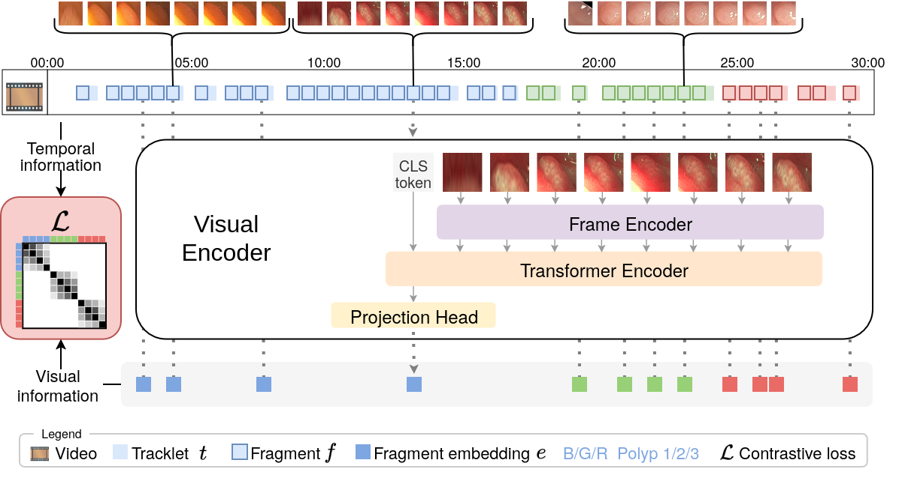
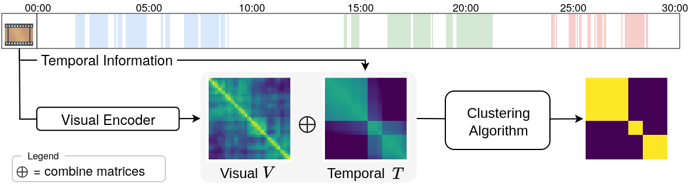

# Temporally-Aware Supervised Contrastive Learning for Polyp Counting in Colonoscopy


[Luca Parolari](https://github.com/lparolari), [Andrea Cherubini](https://www.linkedin.com/in/andrea-cherubini-687414/), [Lamberto Ballan](http://www.lambertoballan.net/), [Carlo Biffi](https://www.linkedin.com/in/carlo-biffi/)

[[paper](http://arxiv.org/abs/2507.02493)] [[code](https://github.com/lparolari/temporally-aware-polyp-counting)]

🌟 Accepted at MICCAI 2025

## Abstract

Automated polyp counting in colonoscopy is a crucial step toward automated procedure reporting and quality control, aiming to enhance the cost-effectiveness of colonoscopy screening.
Counting polyps in a procedure involves detecting and tracking polyps, and then clustering tracklets that belong to the same polyp entity.
Existing methods for polyp counting rely on self-supervised learning and primarily leverage visual appearance, neglecting temporal relationships in both tracklet feature learning and clustering stages.
In this work, we introduce a paradigm shift by proposing a supervised contrastive loss that incorporates temporally-aware soft targets.
Our approach captures intra-polyp variability while preserving inter-polyp discriminability, leading to more robust clustering.
Additionally, we improve tracklet clustering by integrating a temporal adjacency constraint, reducing false positive re-associations between visually similar but temporally distant tracklets.
We train and validate our method on publicly available datasets and evaluate its performance with a leave-one-out cross-validation strategy.
Results demonstrate a 2.2x reduction in fragmentation rate compared to prior approaches.
Our results highlight the importance of temporal awareness in polyp counting, establishing a new state-of-the-art.
Code is available at https://github.com/lparolari/temporally-aware-polyp-counting.




## Usage

### Training

```
python -m polypsense.e2e.cli \
  --mode=train \
  --dataset_root=data/e2e/coco \
  --num_workers=8 \
  --max_epochs=50 \
  --lr=0.00001 \
  --batch_size=56 \
  --im_size=232 \
  --fragment_length=8 \
  --fragment_stride=4 \
  --fragment_drop_last \
  --min_tracklet_length=30 \
  --bbox_scale_factor=5 \
  --n_views=14 \
  --backbone_arch=resnet50 \
  --backbone_weights=IMAGENET1K_V2 \
  --d_model=128 \
  --temperature=0.25 \
  --exp_name=training
```

### 🔍 Evaluation

Evaluation of polyp counting is performed with a leave-one-out cross-validation (LOOCV) strategy. The main metric reported is the fragmentation rate across all videos and its standard deviation, which quantifies how often a polyp is split into multiple clusters.

Evaluation is performed in two stages:

1. Hyperparameter Selection (Validation)

To select clustering hyperparameters, you run the evaluation on the validation split of all videos except one (the held-out test video). Example command:

```
python -m polypsense.e2e.fr2 \
  --dataset_root 'data/e2e/splits/oneout_001-009' \
  --split val \
  --output_path output \
  --encoder_type mve \
  --encoder_ckpt '/path/to/encoder.ckpt' \
  --clustering_type temporal_affinity_propagation \
  --metric_average macro \
  --target_fpr 0.05 \
  --fragment_length -1 \
  --fragment_stride 4 \
  --bbox_scale_factor 5
```

This step selects the best clustering hyperparameters (e.g., alpha, preference) that match the desired false positive rate (FPR) on the validation videos.

2. Final Evaluation (Test)

Once hyperparameters are selected, you can evaluate on the held-out test video. Example command:

```
$ENV_PATH/python -m polypsense.e2e.fr2_online \
  --dataset_root 'data/e2e/splits/oneout_001-009' \
  --split test \
  --output_path output \
  --encoder_type mve \
  --encoder_ckpt '/path/to/encoder.ckpt' \
  --clustering_type temporal_affinity_propagation \
  --metric_average macro \
  --target_fpr 0.05 \
  --fragment_length -1 \
  --fragment_stride 4 \
  --bbox_scale_factor 5 \
  --clustering_hparams '{"affinity": "precomputed", "alpha": 0.550000011920929, "convergence_iter": 50, "damping": 0.9, "fn": "sum", "lambda": 7.375, "max_iter": 500, "preference": 0, "random_state": 42}'
```

Replace the values inside `--clustering_hparams` with those selected during validation.

## Data preparation

This project uses a combined training dataset, named *e2e*, built from publicly available colonoscopy datasets. In total, we use 384 polyps from:
- [REAL-Colon](https://plus.figshare.com/articles/media/REAL-colon_dataset/22202866) (85 polyps)
- [LDPolyp](https://github.com/dashishi/LDPolypVideo-Benchmark) (160 polyps)
- [SUN](http://amed8k.sundatabase.org/) (100 polyps)
- [PolypsSet](https://dataverse.harvard.edu/dataset.xhtml?persistentId=doi:10.7910/DVN/FCBUOR) (39 polyps)

### Combined dataset

1. Download the datasets

- REAL-Colon, use the script available at [cosmoimd/real-colon-dataset](https://github.com/cosmoimd/real-colon-dataset)
- LDPolyp, SUN, PolypsSet, use the script available at [cosmoimd/yolov7](https://github.com/cosmoimd/yolov7/tree/main/colonoscopy/datasets_downloads)

After downloading and extracting these datasets, ensure they are organized in a consistent COCO-style format (i.e., each dataset has an images/ folder and an instances_*.json annotation file).

2. Download annotations for the combined dataset

We provide unified annotations for the full E2E dataset, merging polyps from all sources. Download the COCO-style JSON files for training, validation, and testing from the following links:

| Split | Link                                                                                        |
| ----- | ------------------------------------------------------------------------------------------- |
| Train | [instances\_train.json](#)  |
| Val   | [instances\_val.json](#)    |
| Test  | [instances\_test.json](#)   |

Place these files in the e2e/annotations directory:

```
data/e2e/
└── annotations/
    ├── instances_train.json
    ├── instances_val.json
    └── instances_test.json
```

3. Link all images

After downloading and extracting all datasets, run the provided script to symlink all images into a unified folder:

```bash
python scripts/link_e2e_images.py \
  --source_roots /path/to/realcolon /path/to/ldpolyp /path/to/sun /path/to/polypset \
  --target_root e2e/images
```

This will collect and link all images under:

```
data/e2e/
├── annotations/
└── images/          ← contains symlinks to images across all datasets
```

Make sure the filenames referenced in the annotation files match the actual filenames in the images folder.

After completing all steps, your dataset folder should look like:

```
data/e2e/
├── annotations/
│   ├── instances_train.json
│   ├── instances_val.json
│   └── instances_test.json
└── images/
    ├── dataset3_001-001_1.jpg -> /path/to/realcolon/images/001-001_1.jpg
    └── ...
```